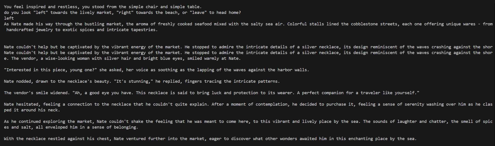

## 11/4/2024: Generative Text Adventure Game

- Beginning with the template, or instructor-supplied starter script (**See Example Code below**). Using my ChooseOwnAdventure.py as my base to start the structure of the textAdventure.py script. After the opening of “The Harbor” ASCII art, I started with the `opening’ scenario that sets the scene. I am curious how the AI agent will interpret the opening scenario. With the Keyword “left,” or “right” that leads to the other options in the story. My thought is that if I provide a descriptive scene for the input, the AI will have more description of the scene to generate a more dynamic output. <br>

### Using this as a template: <br>

```
import openai

openai.api_key = 'your-api-key'  # Replace with your actual API key

def generate_description(choice):
    response = openai.ChatCompletion.create(
        model="gpt-3.5-turbo",
        messages=[{"role": "user", "content": f"Generate a description for the player choosing to go {choice}."}]
    )
    return response['choices'][0]['message']['content']

choice = "left"  # Replace with the player's choice
description = generate_description(choice)
print(description)
```

and following this structure:<br>

```
while True:
    choice = input("Do you want to go left or right? ")
    if choice.lower() == "left":
        print("You encounter a mystical forest!")
        break  # Exit loop or proceed with next choice
    elif choice.lower() == "right":
        print("You find a dark cave!")
        break
    else:
        print("Invalid choice. Please choose 'left' or 'right'.")
```

```
The Harbor                   _
                           _(_)_                              wWWWw      _
        @@@@              (_)@(_)   vVVVv    _        @@@@    (___)    _(_)_
       @@()@@    wWWWw      (_)\    (___)  _(_)_     @@()@@     Y     (_)@(_)
        @@@@     (___)      `|/       Y   (_)@(_)     @@@@    \\|/      (_)
          /        Y       \\|      \\|//   (_)      \\|        |/       |
      \\ |      \\ |/        |/     \\|/   \\|/        |/     \\|      \\|/
    \\\\\|//   \\\\|///  \\\\|//\\\\\\|/// \\|///  \\\\|//  \\\\|//  \\\\|//
    ^^^^^^^^^^^^^^^^^^^^^^^^^^^^^^^^^^^^^^^^^^^^^^^^^^^^^^^^^^^^^^^^^^^^^^^^^

```

### Coding Environment

-  Microsoft Studio 2 <br>
-  VS code w/ WSL Ubuntu <br>

### In the beginning there were errors...

1.	Create a config.py with this script: <br>

``` # Configeration file for textAdventure.py
             openai_api_key = “Input your API Key Here”
```
-	Don’t forget to add the API key, and save the file (ctrl+s) <br>

2.	Create a .gitignore file with this script: <br>

``` # .gitignore
           config.py
```

-	Save the file (ctrl+s) <br>

The reason to create these files is because: <br>

-	The config file will prevent the API’s secret key from being stored in the main program. <br>

At this point, I did a sudo system update and sudo upgrade, followed by `pip install --upgrade openai`. <br>

- Once I was able to get my program to run. Then once the opening story scenario is printed the first set of choices (left and right) is available for the user to make their choice. Upon making the selection of:
``` 'You raise your head from writing, do you look "left", "right", or "leave"?\n').lower() ```

### Error Message 1

```
Traceback (most recent call last):
  File "/mnt/d/myPython/myAI/TextAdventure/textAdventure.py", line 127, in <module>
    main()
  File "/mnt/d/myPython/myAI/TextAdventure/textAdventure.py", line 51, in main
    description = generate_description("left")
  File "/mnt/d/myPython/myAI/TextAdventure/textAdventure.py", line 8, in generate_description
    response = openai.ChatCompletion.create(
  File "/home/hunchen/.local/lib/python3.10/site-packages/openai/lib/_old_api.py", line 39, in __call__
    raise APIRemovedInV1(symbol=self._symbol)
openai.lib._old_api.APIRemovedInV1:
You tried to access openai.ChatCompletion, but this is no longer supported in openai>=1.0.0 - see the README at https://github.com/openai/openai-python  for the API.
You can run `openai migrate` to automatically upgrade your codebase to use the 1.0.0 interface.
Alternatively, you can pin your installation to the old version, e.g. `pip install openai==0.28`
A detailed migration guide is available here: https://github.com/openai/openai-python/discussions/742

```
So, what I learned about the message was that the error occurs on line 8 when the `generate_description` attempts to generate the `response`. The reason I received this is because openAI has changed the codebase that uses the interface. <br>

I figured out what I needed to do. I had to figure out how to `migrate` my textAdventure.py code to the newer API interface.<br>
Resource: <br>
-	README at https://github.com/openai/openai-python 
-	Detailed migration guide is available here: https://github.com/openai/openai-python/discussions/742 

### In my VS code, WSL (Ubuntu) terminal I entered:

`openai migrate`

but received this error message… <br>

### Error Message 2

```
Downloading Grit CLI from https://github.com/getgrit/gritql/releases/latest/download/marzano-x86_64-unknown-linux-gnu.tar.gz Error: Failed to download Grit CLI from https://github.com/getgrit/gritql/releases/latest/download/marzano-x86_64-unknown-linux-gnu.tar.gz
```

- What the message means is that due to the changes to the OpenAI Python library. The `openai.ChatCompletion.create` method is deprecated.

### Attempting to Resolve...

- 1. I had to change the `OpenAI API key` section. <br>

- From `openai.api_key = openai_api_key`
- To:  `client = openai.OpenAI(api_key=openai_api_key)`

- 2. Then in the WSL terminal, I entered:

```
curl -fsSL https://docs.grit.io/install | bash
grit install
grit apply openai
```

- However, since I have never used `grit` before, it was not recognized in my WSL `grit` binary `PATH`, and received another message. However this message states Grit was installed, but the path is not recognized. <br>

```
grit install
grit apply openai
downloading grit 0.1.0-alpha.1730315451 x86_64-unknown-linux-gnu
installing to /home/hunchen/.grit/bin
  grit
everything's installed!
```
- 3. Add a permanent PATH with the grit and WSL message.
```
To add `$HOME/.grit/bin to your PATH`:
    source $HOME/.grit/bin/env (sh, bash, zsh)
    source $HOME/.grit/bin/env.fish (fish)
Command 'grit' not found, did you mean:
```
The message was longer. <br>

So... I must set the path for Grit, and WSL. <br>

- Add `Grit` to the path: <br>
`source $HOME/.grit/bin/env`

Nothing should happened in the terminal... So! verify by entering: <br>
`grit --version` <br>
Verified by this response: <br>
`grit 0.1.1` <br>

### Now, retry the migration commands again:

`grit install` && `grit apply openai`

- You want to make sure the path is permanent so that you do not have to possibly do this again. <br>

In my VS code, WSL terminal I entered:

```
echo ‘source $HOME/.grit/bin/env’ >> ~/.bashrc
source ~/.bashrc
```
...Next...<br>

After setting the path and making it permanent, I was able to run the execution command again.
`python3 textAdventure.py`

### Welcome...


- There are some things I noticed from my first impressions that do need some refinement. <br>
- One issue is the ASCII art welcome scene, the flowers all appear to be one space to the right starting from lines 27 to 21. Although it bothers me visually it is not my focus.<br> 
- I have been wondering how I can better align my “Story Scenarios” with the generated content. <br>
- How will the AI agent interpret my scenarios, then generate content, based on the next possible set of choices, and or options? <br>
- The short answer is I do not think it can do as I truly image... I think the AI agent is reading the textAdverture.py code from top to bottom by each line. Once the user has the option to enter ‘left,’ or ‘right’ the program is waiting for an input from the user.<br>
If the user chooses “left”, or “right” starting on line #50, the AI can only generate a response based on the `opening = input(scene)`. <br>
- So, what I want to figure out is how the `generate_description({choice})` and `message=[role]` is functioning in relation to the generated content. I understand the generated content may be different each time, but how can the story creator ensure the AI-generated content aligns with the next “Story Scenario” prompt<br>

### First Story Response
 <br>

- If you read the first line of the generated content, you read that the player chooses left and they find themselves in a dimly lit corridor:<br>
“As the player chooses to go left, they find themselves in a dimly lit corridor with faded wallpaper peeling off the walls.”<br>
<br>
This is concerning because the generated content does not align with the initial input(scene). This leads me to believe that the AI agent does not take account of the content within the input(scene) constructs.<br>

### After making changes…

- To try and align the story scenario with what the author has written I had to add to the `messages=[…]` role description. From further research, I found that you can add additional roles. This additional role can describe how the AI is to interrupt and then generate a response based on the player's choice. Named `context`. <br>

### User Choice, Left


For eample, notice:<br>


- Line #12: This is a role that has the AI assistant take the author’s scenario into account by passing in the “Opening Story Scenario”,`opening = input(…)` text. This helps better align the AI-generated content with the author’s sequential story scenarios `# Story Scenario 2`.<br>

- In the Generate Description image. The AI-generated response that used the opening story scenario context as a guide for the AI to generate a response that will in theory lead to the AI agent also taking into consideration the player’s other possible choices. This is done by also creating a context description `context += f”…”` that phrases how you might want the AI to generate its response in regards to the next story scenario `# Story Scenario 2`. <br> 

*** In the above generation, I noticed some sentences are duplicated. I am certain with further work; I could prevent this duplication.<br> 

### Choice 2, `cart`


- In the above `cart` section. The player is presented with a “wooden cart that wobbles by…”. Starting at line #89, the context the AI generates from is based on the previous choice’s scenario, this being: `{choice2}`.<br>

- If the player does choose the `cart` or the `fowl`, the AI agent is guided to stay aligned with the author’s scenario.<br>

Example line #94: `# Context to guide the AI generation` <br>
```context += f"\n{player_name} approached the wooden cart filled with trinkets and fresh flowers…``` <br>

### Final Thoughts or Continued Development…

- Working on this project I was able to discover how the AI agent (OpenAI model gpt-3.5-turbo) can function. The AI needs a form of role assignment, that could dictate how the author wants the AI agent to frame its output (or maybe how the author mentally views their written environment). I think a way for the author’s story to be used with an AI agent is you create a way for the author’s text to ‘end’ with an open traversal scene such as line #50, 51: `input(…)` <br>

`You feel inspired and restless, you stand from the simple chair and simple table.\n
        do you look "left" towards the lively market, "right" towards the beach, or "leave" to head home?\n`

### If I were to continue developing this text adventure game… 

-	Ensure all the choices are guided with the generated scenario environment, in attempts to keep the story aligned.<br>

-	Resolve the issue of some of the hard-coded story scenario input(…) being duplicated when the story is generated.<br>

-	Continue the story by adding another set of choices that are presented to the player. <br>
o	This could be in the form of describing how the player walked to the end of the market or the `{player}` continues to walk along the beach of coarse sand to the end, the `{player}` climbs up the embankment of large boulders…<br>
-	Create a way to introduce other characters that the `{player}` talks with. Have the AI generate the conversation, based on the `{player}` history of what the `{player}` has done thus far in their story (as input for conversation) and the history between the introduced character (this could be a pet dog) and their story and choices designed by the author. <br>

### Noted Sources

- •  https://github.com/openai/openai-python 
- •  https://github.com/openai/openai-python/discussions/742 
- •  https://learnprompting.org/docs/prompt_hacking/injection 

